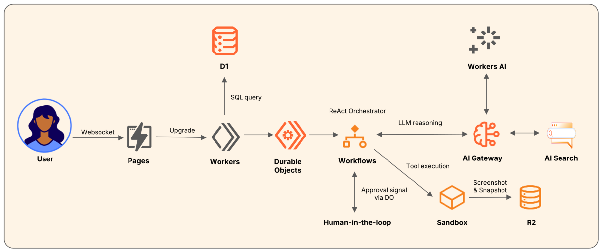

# Build Your AI Agent on Cloudflare

本项目为全栈运行在 Cloudflare 上的 AI Web Research Agent，旨在通过此项目体现 Cloudflare Developer Platform 的架构。



## ⚠️ 部署前必读

本项目已移除所有敏感信息。**不要直接部署**，必须先配置你自己的 Cloudflare 资源。

📖 **详细指南**：
- [SECURITY.md](./SECURITY.md) - 安全配置完整指南
- [worker/WRANGLER_CONFIG.md](./worker/WRANGLER_CONFIG.md) - wrangler.toml 配置说明

---

## 快速开始

### 1. 前置要求

- Node.js 18+
- Cloudflare 账号（免费计划即可）
- [Wrangler CLI](https://developers.cloudflare.com/workers/wrangler/install-and-update/)：`npm install -g wrangler`

### 2. 创建 Cloudflare 资源

```bash
# 登录 Cloudflare
wrangler login

# 创建 D1 数据库
wrangler d1 create agent-user-db
# 复制返回的 database_id

# 创建 R2 Bucket
wrangler r2 bucket create cf-agent-screenshots

# 创建 AI Gateway（在 Dashboard 操作）
# https://dash.cloudflare.com/?to=/:account/ai/ai-gateway
# 创建后记录 Gateway 名称
```

### 3. 配置 wrangler.toml

编辑 `worker/wrangler.toml`，替换占位符：

```toml
# 替换 Account ID（在 Dashboard 右侧边栏）
AI_GATEWAY_BASE = "https://gateway.ai.cloudflare.com/v1/<ACCOUNT_ID>/<GATEWAY_NAME>/compat"

# 替换 D1 Database ID（步骤 2 创建时返回）
database_id = "<YOUR_D1_DATABASE_ID>"

# 替换 R2 Bucket 名称（步骤 2 创建的名称）
bucket_name = "cf-agent-screenshots"
```

### 4. 设置 Secrets

```bash
cd worker

# AI Gateway Token（Dashboard → AI Gateway → Settings → API Token）
wrangler secret put CF_AIG_TOKEN

# Serper API Key（https://serper.dev 注册获取，免费 2500 次/月）
wrangler secret put SERPER_API_KEY

# Jina API Key（可选，https://jina.ai 注册，用于网页抓取）
wrangler secret put JINA_API_KEY
```

### 5. 初始化数据库

```bash
cd worker

# 创建用户表
wrangler d1 execute agent-user-db --remote --command "
CREATE TABLE IF NOT EXISTS users (
  id INTEGER PRIMARY KEY AUTOINCREMENT,
  username TEXT UNIQUE NOT NULL,
  password TEXT NOT NULL,
  role TEXT DEFAULT 'user',
  created_at DATETIME DEFAULT CURRENT_TIMESTAMP
)"

# 创建测试用户（用户名：demo，密码：demo123）
wrangler d1 execute agent-user-db --remote --command "
INSERT INTO users (username, password, role) VALUES ('demo', 'demo123', 'user')"
```

### 6. 部署 Worker

```bash
cd worker
npm install
wrangler deploy
```

记录返回的 Worker URL（例如：`https://cf-agent.your-subdomain.workers.dev`）

### 7. 配置前端

编辑 `agents-website/app/src/lib/api.ts`：

```typescript
export const API_BASE = "https://cf-agent.your-subdomain.workers.dev";
export const WS_BASE = "wss://cf-agent.your-subdomain.workers.dev";
```

或使用环境变量（推荐）：

```bash
# 创建 .env.local
echo 'VITE_API_BASE=https://cf-agent.your-subdomain.workers.dev' > agents-website/app/.env.local
echo 'VITE_WS_BASE=wss://cf-agent.your-subdomain.workers.dev' >> agents-website/app/.env.local
```

### 8. 部署前端

```bash
cd agents-website/app
npm install
npm run build
wrangler pages deploy dist --project-name cf-agent-web
```

### 9. 访问应用

打开 Pages 返回的 URL，使用测试账号登录：
- 用户名：`demo`
- 密码：`demo123`

---

## 架构详解

### 技术栈

| 层 | 技术 | Cloudflare 产品 |
|---|---|---|
| 前端 | React + Tailwind + GSAP | Pages |
| API / 状态 | TypeScript Worker + Durable Object | Workers |
| 编排 | Workflow (plan → review → execute) | Workflows |
| 工具沙盒 | Python + Playwright (Docker) | Sandbox |
| LLM | GLM-4.7-flash via AI Gateway | Workers AI + AI Gateway |
| 用户数据 | SQLite | D1 |
| 截图存储 | Object Storage | R2 |

### Agent 工作流

1. **用户输入任务** → WebSocket 发送到 Durable Object
2. **规划阶段** → LLM 生成 5 步计划 (JSON)
3. **计划审批** → 前端展示计划，用户可确认/修改/终止 (30s 自动执行)
4. **执行阶段** → ReAct 循环，最多 20 步
   - 工具并发执行 (最多 5 个/轮)
   - 失败 URL 自动去重
   - 连续失败自动降级
5. **输出报告** → `write_file` 保存 report.md + 摘要返回用户

### 项目结构

```
cf-agent/
├── worker/                  # Agent 核心
│   ├── src/
│   │   ├── index.ts         # Worker 入口: 路由 + 认证
│   │   ├── agent-session.ts # DO: WebSocket + 状态管理
│   │   └── agent-workflow.ts # Workflow: 规划 + ReAct 循环
│   ├── scripts/             # Sandbox 内工具脚本
│   │   ├── search.py        # Serper API 搜索
│   │   ├── fetch_url.py     # httpx + Jina Reader 抓取
│   │   ├── browse.py        # Playwright 导航 + 截图
│   │   └── extract.py       # CSS 选择器提取
│   ├── Dockerfile           # Sandbox 镜像
│   └── wrangler.toml
│
└── agents-website/app/      # 前端
    └── src/pages/
        ├── Home.tsx          # 落地页 (架构展示)
        ├── Login.tsx         # 登录
        └── Dashboard.tsx     # 任务中心 (计划审批 + 实时日志)
```

---

## 常见问题

**Q: 为什么需要 Serper API Key？**  
A: Agent 的 `search` 工具需要调用搜索引擎。Serper 提供免费 2500 次/月额度。

**Q: 为什么需要 Jina API Key？**  
A: Jina Reader 提供更好的网页内容提取能力（去除广告、导航栏等噪音）。可选配置，不设置则使用 httpx 直接抓取。

**Q: 可以用其他 LLM 吗？**  
A: 可以。修改 `wrangler.toml` 中的 `AI_MODEL` 变量，支持所有 Workers AI 模型。

**Q: 如何查看日志？**  
A: `wrangler tail` 实时查看 Worker 日志，或在 Dashboard → Workers → Logs 查看。

---

## 安全提示

- ✅ Secrets 通过 `wrangler secret` 管理，不要写在代码里
- ✅ 敏感文件已加入 `.gitignore`
- ⚠️ 当前密码是明文存储，生产环境建议实现 bcrypt hash
- ⚠️ 建议添加 Rate Limiting 防止滥用

详见 [SECURITY.md](./SECURITY.md)

---

## License

MIT
